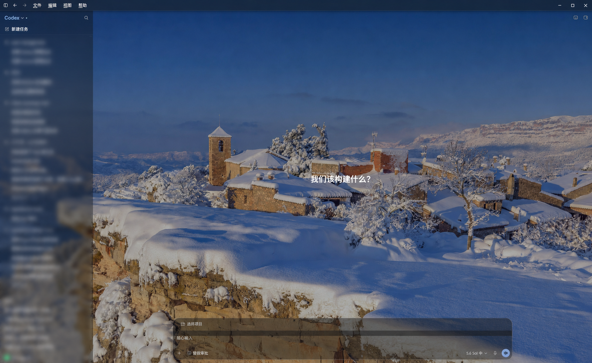
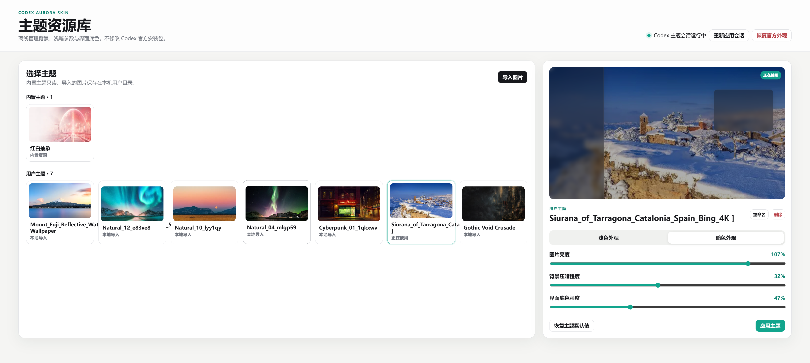

<div align="center">

# Codex Aurora Skin

Managed, reversible, immersive background themes for the Codex desktop app.

[简体中文](./README.md) ·
[Download](https://github.com/Entropy-R/Codex-Aurora-Skin/releases) ·
[Windows guide](./docs/install-windows.md) ·
[Project documentation](./docs/PROJECT.md)

</div>



> [!IMPORTANT]
> This is an unofficial community project. It is not affiliated with,
> sponsored by, or endorsed by OpenAI. It does not modify the official Codex
> installation, account data, model configuration, plugins, or tasks.

## Overview

Codex Aurora Skin is a local theme manager for the Codex desktop app. It
injects background styles through a loopback-only CDP session, blending the
main view, task pages, and composer with a user-selected image while preserving
the official interface and its light/dark appearance.

- Import PNG, JPEG, and WebP images locally.
- Tune brightness, background dimming, and surface strength independently for
  light and dark appearances.
- Browse, apply, rename, and delete user themes.
- Keep built-in themes read-only and preserve user themes across upgrades and
  default uninstall.
- Restore the official appearance and close the CDP session at any time.
- Create no login item and perform no online update checks.

## Screenshots

### Codex desktop

The hero image above shows the theme running in the Codex main view. The theme
affects the background layer and interface surfaces without applying image
filters to text, buttons, icons, or native controls.

### Local theme manager

The manager keeps built-in and imported themes together and stores separate
controls for the light and dark appearances.



> User-imported images shown in these screenshots are examples only. They are
> not included in the repository or installer.

## Platform and release status

| Platform | Status | Distribution |
| --- | --- | --- |
| Windows 10/11 | Released | Download `CodexAuroraSkin-Setup-v*.exe` from Releases |
| macOS | Released | Download `CodexAuroraSkin-v*.dmg` from Releases |

Public artifacts do not currently use commercial code signing. The macOS app has
an ad-hoc signature and is not notarized by Apple, so its first launch requires
explicit approval in System Settings > Privacy & Security. Verify the installer
against the `SHA256SUMS.txt` file included with its GitHub Release.

Version `v1.0.1` fixes the composer overflow in some window sizes, supports the
Codex 26.810 main-area, header, and composer structure, and improves manager
heartbeat and theme reconnection after macOS sleep. The browser manager now
prompts users to reopen the app instead of showing `Failed to fetch` when it is
disconnected.

### First use on macOS

1. Open the downloaded DMG and drag **Codex Aurora Skin** to **Applications**.
2. Try to launch it once. If macOS blocks it, verify its SHA-256 against the
   release, then use **Open Anyway** in System Settings > Privacy & Security.
3. Launch the app again to open the local theme manager in your browser.
4. Choose a theme and apply it. Approve the Codex restart when prompted.
5. Use **Restore official appearance** in the manager to end the themed session.

See the [macOS installation guide](./docs/install-macos.md) and
[Apple's official safety guidance](https://support.apple.com/en-us/102445).

## Quick start

1. Download the Windows installer and checksum file from
   [GitHub Releases](https://github.com/Entropy-R/Codex-Aurora-Skin/releases).
2. Verify the installer's SHA-256, then run it.
3. Launch **Codex Aurora Skin**. The local-only theme manager opens in your
   browser.
4. Select a built-in theme or import an image, adjust its controls, and choose
   **Apply theme**.
5. Choose **Restore official appearance** when you want to end the themed
   session.

See the [Windows installation guide](./docs/install-windows.md) for complete
steps, state directories, and uninstall behavior.

## Theme controls

| Control | Dark appearance | Light appearance | Effect |
| --- | --- | --- | --- |
| Image brightness | `0.35–1.20` | `0.35–1.20` | Background image only |
| Background dimming | `0–0.70` | `0.32–0.70` | Maintains foreground contrast |
| Surface strength | `0.20–1.00` | `0.60–1.00` | Changes panel translucency |

Themes always use `appearance: auto` and follow the official Codex light or
dark appearance.

## Security boundary

- The manager binds only to `127.0.0.1` on an ephemeral port.
- Each launch creates a random 256-bit token and validates Host, Origin, and
  Bearer authentication.
- The page enables a strict CSP and `Referrer-Policy: no-referrer`.
- Imports are limited to 16 MB, 16384 px per side, and 50 megapixels.
- Theme and override updates use staging and atomic replacement.
- The manager exits after 120 seconds without an authenticated client.
- Restore stops the injector, closes the CDP session, and relaunches Codex
  normally.

## Development and verification

Repository layout:

```text
manager/   Local theme service and web interface
runtime/   Shared styles and renderer injection
windows/   Windows installation, launch, restore, and tests
macos/     macOS source, scripts, and tests
library/   Offline built-in theme catalog
docs/      Installation and project documentation
tools/     Consistency checks and development utilities
```

Windows and shared modules:

```powershell
node --test manager/*.test.mjs
pwsh -NoProfile -File windows/tests/run-tests.ps1
pwsh -NoProfile -File windows/tests/installer-static.tests.ps1
node tools/sync-runtime-assets.mjs --check
```

The macOS build and regression suite must run on macOS:

```bash
./macos/tests/run-tests.sh
swift test --package-path macos/menubar-app
./macos/scripts/build-dmg.sh --skip-tests
```

Further reading:

- [Project design](./docs/PROJECT.md)
- [Windows installation](./docs/install-windows.md)
- [macOS installation](./docs/install-macos.md)
- [Platform differences](./docs/platforms.md)
- [Development roadmap](./docs/ROADMAP.md)
- [Development workflow](./docs/DEVELOPMENT_WORKFLOW.md)
- [Windows Codex handoff prompt](./docs/WINDOWS_V1.0.1_HANDOFF_PROMPT.md)

## License

Code is released under the [MIT License](./LICENSE). See [NOTICE](./NOTICE.md)
for third-party notices.
